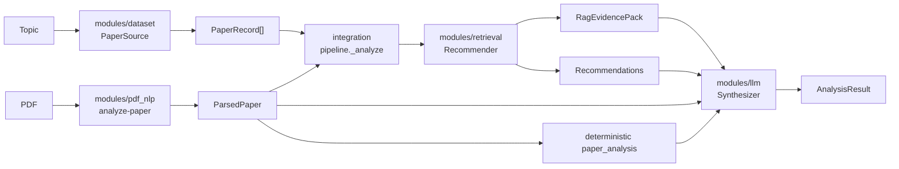

# System Architecture

COMP8420 Use Case 3: a local research-paper analysis and recommendation system.

The system comprises four capability modules orchestrated by an integration
layer. Each module exposes a CLI and produces JSON artifacts that conform to
shared dataclass contracts defined in
[`integration/app/contracts.py`](../integration/app/contracts.py). Schema
validation for `ParsedPaper` is also implemented in
[`modules/llm/app/schemas.py`](../modules/llm/app/schemas.py).

## Repository layout

```
integration/          # CLI, API, Vite frontend, orchestration
modules/
  dataset/            # PaperRecord corpus, EDA, enrichment
  retrieval/          # Hybrid ranking, RAG evidence packs
  llm/                # Prompts, Ollama runtime, LoRA synthesis
  pdf_nlp/            # PDF parsing, POS, NER, keyphrases, structural checks
docs/                 # Project documentation
```

## Entry points

From the repository root:

```text
python rpa.py run --query "topic text"
python rpa.py analyze-pdf <path-to-pdf>
python rpa.py web
```

Or from `integration/`:

```text
python -m app.cli run --query "topic text"
```

### Topic search (`run`)

1. Load `modules/dataset/data/processed/dev_5k_balanced.jsonl`
2. Subprocess → `modules/retrieval` (`recommend-topic`)
3. Subprocess → `modules/llm` (`synthesize` with Ollama)
4. Write runtime artifacts under `integration/outputs/` and
   `integration/data/sessions/`

### PDF analysis (`analyze-pdf`)

1. Subprocess → `modules/pdf_nlp` (`analyze-paper`) producing an enriched `ParsedPaper`
2. Optional subprocess → `modules/retrieval` using the parsed title/abstract query
3. Subprocess → `modules/llm` with the paper and deterministic `analysis` evidence
4. Peer-review synthesis and a single `AnalysisResult.paper_analysis`

Use `--no-related-papers` for the paper-only path. Production commands reject
executed mock providers.

The canonical browser UI is the Vite project under `integration/frontend/`.
Development uses its `/api` proxy; a production build is served by FastAPI from
the same origin. The UI uses one timestamped session per analysis and one
synchronous request per action.

## Data flow

```
modules/dataset       data/processed/dev_5k_balanced.jsonl  PaperRecord[]
  -> modules/pdf_nlp  generated ParsedPaper + sidecars       ParsedPaper
  -> modules/retrieval generated recommendation/RAG files   Recommendation + RagEvidencePack
  -> modules/llm      generated synthesis files              structured synthesis
  -> integration      outputs/analysis_result.json          AnalysisResult
```

`pipeline._analyze` in `integration/app/pipeline.py` is the common
orchestration path for PDF and topic inputs. `app/service.py` constructs a
`Providers` container for each request and passes it explicitly into the
pipeline.



**Flow:** PDF parse or topic input → optional RAG evidence and recommendations →
LLM synthesis (peer review when a parsed paper exists) → `AnalysisResult`.

Explicit exceptions avoid unnecessary retrieval:

- PDF `--no-related-papers` and `modules/llm summarize` consume a supplied
  `ParsedPaper` directly.
- Integration `chat` classifies every text message. Conversational text uses the
  local LLM directly without loading the recommender; substantive research
  questions retain evidence retrieval before LLM synthesis.

## Shared contracts

| Contract object | Module | Runtime artifact | Provider |
| --- | --- | --- | --- |
| `PaperRecord[]` | `modules/dataset` | `modules/dataset/data/processed/dev_5k_balanced.jsonl` | `LivePaperSource` |
| enriched `ParsedPaper` | `modules/pdf_nlp` | generated parser/NLP sidecars | `SubprocessPdfParser` |
| `Recommendation` | `modules/retrieval` | `integration/outputs/recommendations.json` | `SubprocessRecommender` |
| `RagEvidencePack` | `modules/retrieval` | `integration/outputs/rag_evidence_pack.json` | `SubprocessRecommender` |
| synthesis (md / JSON) | `modules/llm` | `integration/outputs/llm_analysis.md` | `SubprocessSynthesizer` |
| `AnalysisResult` | `integration` | `integration/outputs/analysis_result.json` | assembled in pipeline |

Production providers are constructed in `integration/app/service.py`:

- `SubprocessPdfParser` → `modules/pdf_nlp/app/cli.py analyze-paper`
- `LivePaperSource` → dataset module processed corpus slice
- `SubprocessRecommender` → retrieval module `recommend-topic`
- `SubprocessSynthesizer` → LLM module `summarize` or `synthesize`

PDF analysis parses first and builds the retrieval query from the paper title,
with the abstract as fallback.

**Dependency order:** `dataset` → `pdf_nlp` → `retrieval` → `llm`.

## Developing a module

Each module has its own `app/` package and can be tested independently:

```text
python -m modules.retrieval.app.cli recommend-topic \
  --papers modules/dataset/data/processed/dev_5k_balanced.jsonl \
  --out modules/retrieval/outputs/recommendations.json \
  --query "topic text"
```

Integration does not duplicate module implementations. Runtime outputs, session
logs, raw datasets, and caches are gitignored. Curated, sanitized demonstration
traces live under `integration/results/`.

Structured event schema and session navigation:
[`OBSERVABILITY.md`](OBSERVABILITY.md).

Provider wiring details: [`integration/INTEGRATION.md`](../integration/INTEGRATION.md).

## Evaluation limitations

Known limitations are documented in [`REPRODUCIBILITY.md`](REPRODUCIBILITY.md).
In brief: PDF-NLP evaluation uses five real papers with provisional annotations;
retrieval evaluation uses a small gold query set on the 5,000-paper corpus;
LoRA adapter quality claims require Ollama runs with empty error fields and
human review.
