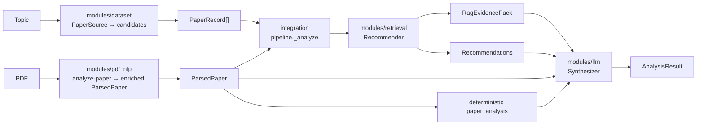

# Integration Map

How capability modules connect. **`integration/`** orchestrates **`modules/*`**
through shared contracts and request-scoped concrete providers; see
[`docs/CONTRIBUTIONS.md`](../docs/CONTRIBUTIONS.md) for contributor credits.

## Data flow

```
modules/dataset       data/processed/dev_5k_balanced.jsonl  PaperRecord[]
  -> modules/pdf_nlp  generated ParsedPaper + sidecars     ParsedPaper
  -> modules/retrieval generated recommendation/RAG files  Recommendation + RagEvidencePack
  -> modules/llm      generated synthesis files            structured synthesis
  -> integration      outputs/analysis_result.json         AnalysisResult
```

## System architecture (core NLP / LLM path)

`pipeline._analyze` in `integration/app/pipeline.py` is the common
orchestration path for PDF and topic inputs. `app/service.py` constructs a
`Providers` container for each request and passes it explicitly into the
pipeline.



**Flow:** PDF parse or topic input → optional RAG evidence and recommendations →
LLM synthesis (peer review when a parsed paper exists) → `AnalysisResult`.

Explicit exceptions avoid unnecessary retrieval:

- PDF `--no-related-papers` and `modules/llm summarize` consume a supplied
  `ParsedPaper` directly.
- integration `chat` classifies every text message. Conversational text uses the
  local LLM directly without loading the recommender; substantive research
  questions retain evidence retrieval before LLM synthesis.

## Contract, module, and provider

| Contract object | Module | Runtime artifact | Concrete provider |
| --- | --- | --- | --- |
| `PaperRecord[]` | `modules/dataset` | `data/processed/dev_5k_balanced.jsonl` | `LivePaperSource` |
| enriched `ParsedPaper` | `modules/pdf_nlp` | generated parser/NLP sidecars | `SubprocessPdfParser` |
| `Recommendation` | `modules/retrieval` | generated `recommendations.json` | `SubprocessRecommender` |
| `RagEvidencePack` | `modules/retrieval` | generated `rag_evidence_pack.json` | `SubprocessRecommender` |
| synthesis (md / JSON) | `modules/llm` | generated LLM outputs | `SubprocessSynthesizer` |
| `AnalysisResult` | `integration` | `outputs/analysis_result.json` at runtime; curated examples under `results/demo/` | (assembled in pipeline) |

## Production provider wiring

Production commands construct providers in `app/service.py`:

- `SubprocessPdfParser` → `modules/pdf_nlp/app/cli.py analyze-paper`
- `LivePaperSource` → dataset module processed corpus slice
- `SubprocessRecommender` → retrieval module `recommend-topic`
- `SubprocessSynthesizer` → LLM module `summarize` or `synthesize`

PDF analysis parses first and builds the retrieval query from the paper title, with
the abstract as fallback. The parser and deterministic NLP are not replaced by
an LLM-side imitation.

Async API jobs use one worker to avoid concurrent large-model loads:

- `POST /api/jobs/analyze-pdf`
- `POST /api/jobs/search-topic`
- `GET /api/jobs/{job_id}?after=<cursor>`

These endpoints remain available for automation and observability. The canonical
frontend uses one synchronous `/api/chat` or `/api/analyze-pdf` request per user
action and does not render execution events inside the chat thread.

## Provider lifecycle

1. `app/service.py` creates a fresh `Providers` container for each request.
2. The parser runs before any related-paper provider is configured.
3. Retrieval providers are added only for routes that require them.
4. The container is passed directly to `app/pipeline.py`; no global state is
   reset or preserved between requests.
5. Session events retain `file-backed` and `live` source labels.

**Dependency order:** `dataset` → `pdf_nlp` → `retrieval` → `llm`.

## Current limitations

- PDF-NLP evaluation uses five real papers with provisional annotations. The
  current deterministic baseline NER outperforms SciER and hybrid.
- Use production commands and `tests/logs/` session evidence for integration claims.
- Runtime `data/sessions/` and `outputs/` files are generated and ignored. Move
  only redacted, reviewable evidence into `results/`.
- The canonical UI is `integration/frontend/`; the removed root `app/` and
  `ui/` copies must not be recreated.
- Logging details are in `docs/OBSERVABILITY.md`.
