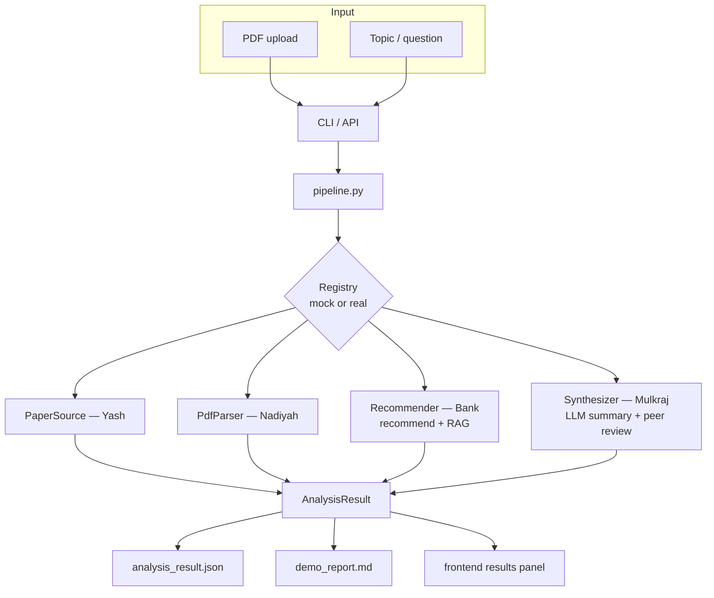

# Sidharth's Workstream Guide — CLI · API · Frontend · Demo · Integration

This is the integration layer for the Use Case 3 system. Two entry paths exist:

- **`run-demo`** — cached/mock smoke path for deterministic demos and stage artifacts.
- **`run --query "..."`** — topic-mode POC with real corpus slice, Bank retrieval subprocess,
  and Ollama synthesis.
- **`analyze-pdf <pdf>`** — production PDF parse, optional Bank retrieval, and
  Mulkraj paper-aware synthesis.

Each teammate's real module can also drop in via file-backed providers with no CLI changes.
This document is the single reference for the team.

---

## 1. Mental model (read this first)

The pipeline defines the sequence while providers implement each capability.
The registry identifies whether a role is `mock`, `file-backed`, or `live`.
Production topic and PDF commands register live module adapters; `run-demo`
keeps deterministic mocks for smoke tests and presentation fallback.

For PDF analysis, parsing happens before provider registration for retrieval.
The parsed title, with abstract fallback, becomes the Bank query. This prevents
the recommender from running with an empty or generic query.

---

## 2. The five contracts (the forms everyone fills in)

Defined in `app/contracts.py` and aligned with the nested canonical
`ParsedPaper` handoff.

| Object | Owner | Produced as file |
| --- | --- | --- |
| `PaperRecord` | Yash | `data/processed/dev_5k.jsonl` |
| `ParsedPaper` | Nadiyah | `outputs/parsed_paper.json` |
| `Recommendation` | Bank | `outputs/recommendations.json` |
| `RagEvidencePack` | Bank | `outputs/rag_evidence_pack.json` |
| synthesis (markdown + JSON) | Mulkraj (`modules/llm/`) | `outputs/llm_analysis.md`, `outputs/analysis_result_from_llm.json` |
| `AnalysisResult` | Sidharth | `outputs/analysis_result.json` |

---

## 3. Architecture



---

## 4. The nine stages (all light; 01 is the only meaty one)

| Stage | What it adds | Run | Artifact |
| --- | --- | --- | --- |
| 01 | CLI shell + mocks (the engine) | `python -m app.cli run-demo` | `analysis_result.json`, `demo_report.md` |
| 02 | Every member command on one entry point | `python -m app.cli classify-domains` | `cli_command_matrix.md` |
| 03 | Privacy / no-retention (temp files deleted) | `python -m app.cli analyze-pdf <pdf>` | `privacy_check.md` |
| 04 | Local FastAPI endpoints | `scripts/rpa web` | `api_contract.md` |
| 05 | Canonical Vite UI | `scripts/rpa web --rebuild` | built UI served by FastAPI |
| 06 | Cached deterministic demo + trace | `python -m app.cli run-demo --cached` | `demo_report.md`, `demo_trace.json` |
| 07 | Swap mocks for real modules | `python -m app.cli run-demo --auto` | `integration_status.md` |
| 08 | 5-minute video script | (document) | `video_demo_script.md` |
| 09 | Submission packaging checklist | (document) | `submission_packaging_checklist.md` |

Regenerate every artifact at once:
```bash
python -m app.cli build-artifacts
```

---

## 5. How to run

From the repository root:

```bash
pip install -r requirements.txt

# Topic-mode POC — real corpus + retrieval + Ollama synthesis (requires Ollama)
scripts/rpa run --query "retrieval augmented generation for scientific literature"

# PDF production path
scripts/rpa analyze-pdf ../tests/papers/drq_v2/2107.09645v1.pdf
scripts/rpa analyze-pdf ../tests/papers/drq_v2/2107.09645v1.pdf --no-related-papers

# Mock/cached smoke demo
scripts/rpa run-demo
scripts/rpa run-demo --auto          # file-backed modules where artifacts exist

scripts/rpa search-topic "retrieval augmented generation for science"
scripts/rpa web                            # UI + API at http://127.0.0.1:8000
```

Runtime session logs under `data/sessions/` are ignored. Curated, redacted
evidence belongs under `results/traces/`.

---

## 6. Production and demo wiring

Production orchestration in `app/service.py` calls:

1. Nadiyah `analyze-paper` for parsing and deterministic PDF-NLP enrichment.
2. Yash's corpus through a file-backed paper source.
3. Bank `recommend-topic` for evidence and related papers.
4. Mulkraj `summarize` for parsed-paper synthesis or `synthesize` for topic RAG.

`run-demo --auto` is a separate compatibility path that activates available
file artifacts and may retain mocks for missing roles.

---

## 7. Verified status and limitations

- PDF-NLP, integration, and LLM suites pass: 23 + 24 + 32 tests.
- The real sample PDF produces 52 references with a 390-character maximum.
- Paper-only PDF mode executes no retrieval command.
- Related-paper PDF mode uses the parsed title and live Bank recommender.
- Proxy synthesis remains wiring evidence only.
- POS/NER/keyphrases, TextRank, and structural PDF checks are integrated.
- Browser evidence demonstrates the single-request chat UI; the final video remains pending.
